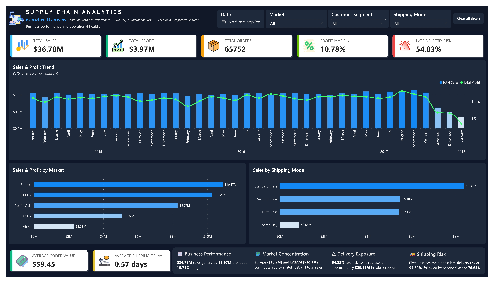
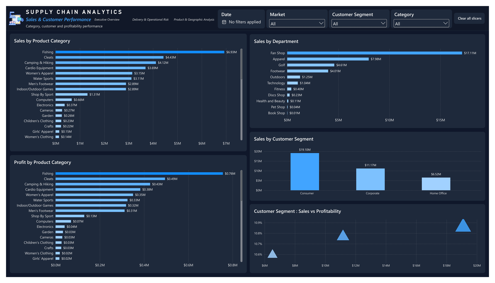
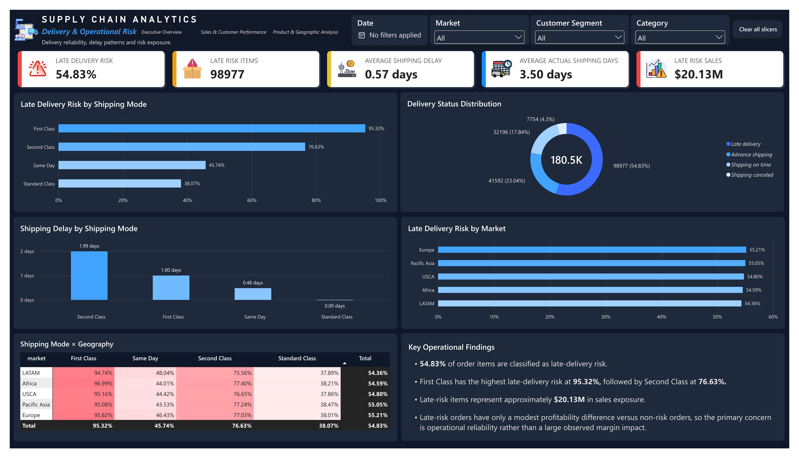
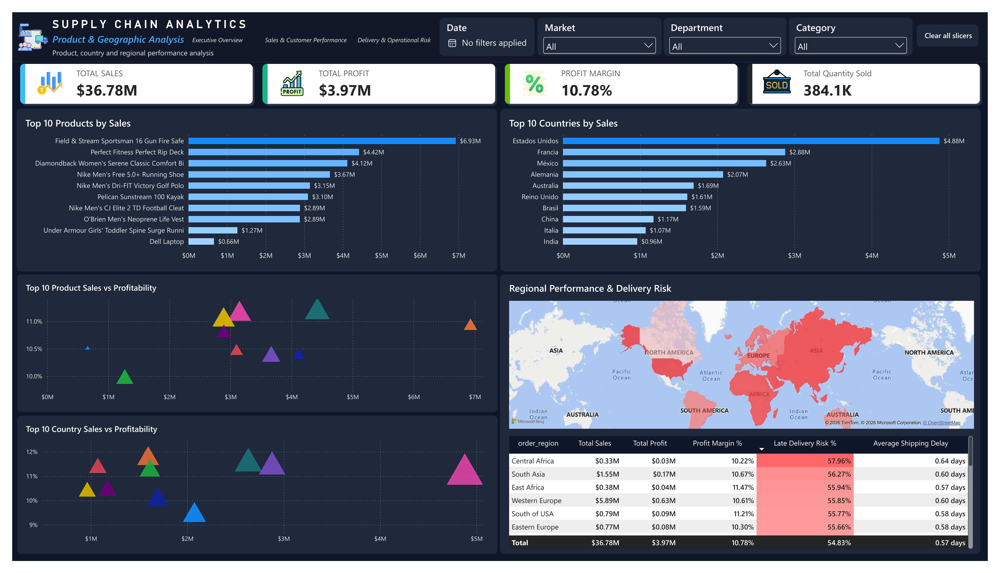

# Supply Chain Analytics

An end-to-end supply chain analytics project combining **Python ETL,
PostgreSQL, SQL analytics, and Power BI** to transform raw transactional
data into a structured analytical warehouse and an interactive business
intelligence dashboard.

The project focuses on **sales performance, profitability, customer
behavior, product performance, geographic performance, and
delivery/operational risk**.

## Project Overview

This project builds an analytical workflow that:

1. Processes raw supply chain data using Python.
2. Loads transformed data into PostgreSQL.
3. Organizes the warehouse using a **star schema**.
4. Validates data integrity and dimensional grain.
5. Performs KPI, root-cause, and advanced SQL analysis.
6. Connects the PostgreSQL warehouse to Power BI.
7. Delivers an interactive four-page executive and analytical
   dashboard.

### Core business questions

- How much sales and profit are being generated?
- What is the overall profit margin?
- How does performance change over time?
- Which categories, departments, and products contribute most to sales
  and profit?
- How do customer segments perform?
- Which markets and countries contribute most to sales?
- Which shipping modes have the highest delivery risk?
- Where are delays concentrated?
- How does delivery risk vary by geography and shipping mode?
- Which products and countries combine high sales with different
  profitability levels?

## Business Objectives

- Build a reliable analytical data warehouse.
- Create reusable SQL-based business metrics.
- Validate relationships and data integrity before reporting.
- Analyze sales and profitability across time, products, customers,
  and geography.
- Identify delivery-risk patterns and operational exposure.
- Provide an interactive Power BI dashboard for management-level
  analysis.
- Present findings in a business-friendly portfolio format.

## Technology Stack

| Layer | Technology | Primary Purpose |
| :--- | :--- | :--- |
| **ETL & Scripting** | Python 3.x | Data extraction, automated cleaning, profiling, and loading |
| **Data Processing** | Pandas, NumPy | Data manipulation, column normalization, type enforcement |
| **Database Engine** | PostgreSQL | Relational analytical data warehouse |
| **DB Connector** | psycopg2 | Python-to-PostgreSQL database connection driver |
| **Analytics Engine** | SQL (PostgreSQL Dialect) | Data validation scripts, KPI views, root-cause queries |
| **Business Intelligence** | Power BI Desktop | Semantic modeling, custom visual design, executive dashboarding |
| **Calculations** | DAX | Time-intelligence calculations, dynamic reporting measures |
| **Version Control** | Git & GitHub | Code versioning, documentation hosting, portfolio release |

## Architecture

```text
Raw Supply Chain Data
        ↓
Python ETL Layer
        ↓
PostgreSQL Warehouse
        ↓
Data Validation
        ↓
SQL Analytics
        ↓
Power BI Data Model
        ↓
DAX Measures
        ↓
Interactive Dashboard
```

## Data Warehouse

The PostgreSQL warehouse follows a **star schema**:

```text
                 dim_customer
                      │
                      │
dim_product ─── fact_order_items ─── dim_date
                      │
                      │
                dim_location
                      │
                      │
                dim_shipping
```

### Dimension tables

**`dim_customer`** --- customer attributes and customer segments.

**`dim_product`** --- product, category and department attributes.

**`dim_date`** --- normalized calendar dates used for time-based
analysis.

**`dim_location`** --- geographic grain using:

```text
market
order_region
order_country
order_state
order_city
```

Latitude and longitude are descriptive attributes rather than identity
fields.

**`dim_shipping`** --- shipping-mode attributes.

### Fact table

**`fact_order_items`** contains transactional order-item records and
measures including:

- Order identifiers
- Customer/product/date/location/shipping keys
- Sales
- Profit
- Quantity
- Actual shipping days
- Shipping delay
- Late-delivery risk

## Final Warehouse Counts

  Table                     Rows

---

  `dim_customer`          20,652
  `dim_product`              118
  `dim_date`               1,127
  `dim_location`           3,772
  `dim_shipping`               4
  `fact_order_items`     180,519

### Fact validation

- Total fact rows: **180,519**
- Unique `order_item_id`: **180,519**
- Duplicate `order_item_id`: **0**
- Missing customer keys: **0**
- Missing product keys: **0**
- Missing date keys: **0**
- Missing location keys: **0**
- Missing shipping keys: **0**

## ETL Pipeline

### `python/10_dimension_etl.py`

Loads:

- Customer dimension
- Product dimension
- Date dimension
- Location dimension
- Shipping dimension

The location dimension uses the five-field geographic grain:

```text
market
order_region
order_country
order_state
order_city
```

### `python/11_fact_etl.py`

The fact ETL:

1. Reads prepared source data.
2. Performs dimension lookups.
3. Resolves warehouse keys.
4. Validates lookup completeness.
5. Loads fact records into PostgreSQL.
6. Commits the transaction.

Final load:

```text
Source rows:     180,519
Rows prepared:   180,519
Rows inserted:   180,519
Final fact rows: 180,519
```

## SQL Analytics Layer

### `01_database_schema.sql`

Creates the PostgreSQL warehouse schema.

### `02_data_integrity_validation.sql`

Validates row counts, primary-key uniqueness, foreign-key integrity,
null foreign keys, and location grain.

### `03_supply_chain_kpis.sql`

Contains core KPI analysis covering:

- Orders and order items
- Quantity
- Sales
- Profit
- Profit margin
- Average order value
- Shipping delay
- Delivery risk
- Delivery status
- Shipping mode
- Time
- Customer segment
- Category
- Department
- Geography
- Products

### `04_root_cause_analysis.sql`

Investigates:

- Shipping-mode risk
- At-risk versus non-at-risk profitability
- Geographic delivery risk
- Shipping-mode/geography interaction
- High-risk operating areas
- Delivery exposure

The analysis distinguishes **association from causation**.

### `05_advanced_analytics.sql`

Provides deeper analysis such as:

- Customer value and segmentation
- Repeat versus one-time customers
- Product profitability
- Pareto contribution
- Delivery-risk concentration
- High-sales/low-profit products
- High-risk/high-volume geographies
- Shipping benchmarking
- Time-based analysis

## Power BI Model

Power BI connects directly to the PostgreSQL star schema.

```text
dim_customer[customer_id]  1 ─── * fact_order_items[customer_id]
dim_product[product_id]    1 ─── * fact_order_items[product_id]
dim_date[date_id]          1 ─── * fact_order_items[date_id]
dim_location[location_id]  1 ─── * fact_order_items[location_id]
dim_shipping[shipping_id] 1 ─── * fact_order_items[shipping_id]
```

Relationships use single-direction filtering from dimensions to the fact
table.

## Core DAX Measures

The report uses a dedicated `_Measures` table.

```dax
Total Sales =
SUM(fact_order_items[sales])
```

```dax
Total Profit =
SUM(fact_order_items[order_profit_per_order])
```

```dax
Total Orders =
DISTINCTCOUNT(fact_order_items[order_id])
```

```dax
Total Order Items =
COUNTROWS(fact_order_items)
```

```dax
Total Quantity Sold =
SUM(fact_order_items[order_item_quantity])
```

```dax
Profit Margin % =
DIVIDE([Total Profit], [Total Sales])
```

```dax
Average Order Value =
DIVIDE([Total Sales], [Total Orders])
```

```dax
Late Delivery Risk % =
AVERAGE(fact_order_items[late_delivery_risk])
```

```dax
Late Risk Items =
CALCULATE(
    [Total Order Items],
    fact_order_items[late_delivery_risk] = 1
)
```

```dax
Average Shipping Delay =
AVERAGE(fact_order_items[shipping_delay_days])
```

```dax
Average Actual Shipping Days =
AVERAGE(fact_order_items[days_for_shipping_real])
```

```dax
Late Risk Sales =
CALCULATE(
    [Total Sales],
    fact_order_items[late_delivery_risk] = 1
)
```

# Dashboard

## 01 --- Executive Overview

**Business performance and operational health.**

Focuses on:

- Total Sales
- Total Profit
- Total Orders
- Profit Margin
- Late Delivery Risk
- Average Order Value
- Average Shipping Delay
- Sales & Profit Trend
- Sales & Profit by Market
- Sales by Shipping Mode
- Executive business insights

### Baseline

```text
Sales:                 $36.78M
Profit:                 $3.97M
Orders:                 65,752
Profit Margin:           10.78%
Late Delivery Risk:      54.83%
Average Order Value:     $559.45
Average Shipping Delay:   0.57 days
```

**Data note:** 2018 contains January data only and should not be
interpreted as a complete-year comparison.



## 02 --- Sales & Customer Performance

**Category, customer and profitability performance.**

Focuses on:

- Sales by Product Category
- Profit by Product Category
- Sales by Department
- Sales by Customer Segment
- Customer Segment: Sales vs Profitability



## 03 --- Delivery & Operational Risk

**Delivery reliability, delay patterns and risk exposure.**

Focuses on:

- Late Delivery Risk
- Late Risk Items
- Average Shipping Delay
- Average Actual Shipping Days
- Late Risk Sales
- Late Delivery Risk by Shipping Mode
- Delivery Status Distribution
- Shipping Delay by Shipping Mode
- Late Delivery Risk by Market
- Shipping Mode × Geography
- Key Operational Findings



## 04 --- Product & Geographic Analysis

**Product, country and regional performance analysis.**

Focuses on:

- Top 10 Products by Sales
- Top 10 Countries by Sales
- Top 10 Product Sales vs Profitability
- Top 10 Country Sales vs Profitability
- Regional Performance & Delivery Risk
- Geographic visualization



---

## Key Business Findings

### Overall performance

- **\$36.78M** total sales
- **\$3.97M** total profit
- **10.78%** profit margin
- **65,752** orders
- **180,519** order items
- **384,079** units sold

### Delivery risk

- **54.83%** of order items are classified as late-delivery risk.
- **98,977** items are classified as late-risk items.
- Approximately **\$20.13M** in sales are associated with late-risk
  items.
- First Class: **95.32%** late-delivery risk.
- Second Class: **76.63%**.
- Same Day: **45.74%**.
- Standard Class: **38.07%**.

These are observed associations in the dataset and are not claims of
causation.

### Market concentration

Major markets by sales include:

- Europe --- approximately **\$10.9M**
- LATAM --- approximately **\$10.3M**
- Pacific Asia --- approximately **\$8.3M**
- USCA --- approximately **\$5.1M**
- Africa --- approximately **\$2.3M**

Europe and LATAM together contribute approximately **58% of total
sales**.

### Customer segments

The dashboard analyzes:

- Consumer
- Corporate
- Home Office

Consumer contributes the largest sales amount, while segment
profitability levels are relatively close.

### Product performance

The dashboard identifies major sales contributors across categories
including:

- Fishing
- Cleats
- Camping & Hiking
- Cardio Equipment
- Women's Apparel
- Water Sports
- Men's Footwear
- Indoor/Outdoor Games
- Shop By Sport

## Data Considerations

### 2018 partial-year data

The available data contains **January 2018 only**. It should not be
compared with complete years as though it represented a full year.

### Association versus causation

The project identifies patterns and relationships. For example, a
shipping mode with higher late-delivery risk is reported as being
**associated with** higher risk rather than being described as the
direct cause.

### Geographic grain

Location identity uses:

```text
market
order_region
order_country
order_state
order_city
```

Latitude and longitude are descriptive attributes.

## Repository Structure

```text
supply_chain_analytics/
├── data/
│   ├── raw/
│   └── processed/
├── python/
│   ├── ...
│   ├── 10_dimension_etl.py
│   └── 11_fact_etl.py
├── sql/
│   ├── 01_database_schema.sql
│   ├── 02_data_integrity_validation.sql
│   ├── 03_supply_chain_kpis.sql
│   └── 04_root_cause_analysis.sql
├── powerbi/
│   ├── output_screenshots/
│   ├── supply_chain_analytics.pbix
│   └── supply_chain_analytics.pbix
└── README.md
```

## Project Workflow

```text
Raw Data
   ↓
Python ETL
   ↓
PostgreSQL Star Schema
   ↓
Data Integrity Validation
   ↓
SQL KPI Analysis
   ↓
Root-Cause Analysis
   ↓
Power BI Data Model
   ↓
DAX Measures
   ↓
Interactive Dashboard
```

## Running the Project

### Prerequisites

- Python 3.x
- PostgreSQL
- Power BI Desktop
- Git

Python dependencies include:

```text
pandas
numpy
psycopg2
```

### 1. Create the database

Create:

```text
supply_chain_analytics
```

### 2. Create the warehouse

Run:

```text
sql/01_database_schema.sql
```

### 3. Run dimension ETL

```text
python/10_dimension_etl.py
```

### 4. Run fact ETL

```text
python/11_fact_etl.py
```

### 5. Validate

Run:

```text
sql/02_data_integrity_validation.sql
```

### 6. Run analytics

```text
sql/03_supply_chain_kpis.sql
sql/04_root_cause_analysis.sql
```

### 7. Open Power BI

Open:

```text
powerbi/supply_chain_analytics.pbix
```

Connect to the PostgreSQL warehouse and refresh the model as required.

## Design Approach

The dashboard uses a dark executive-style design with:

- Dark navy canvas
- Light visual panels
- White KPI cards
- Blue primary analytical color
- Green for positive/profit context
- Red/orange for operational risk
- Consistent typography and spacing
- Interactive slicers
- Compact business-friendly number formatting

The design emphasizes analytical clarity over decorative elements.

## Skills Demonstrated

### Data Engineering / ETL

- Python data processing
- ETL pipeline design
- Dimension and fact loading
- Data-quality validation
- PostgreSQL warehouse development

### SQL / Analytics

- Star-schema design
- Relational data modeling
- Aggregations
- KPI development
- Root-cause analysis
- Geographic analysis
- Product and customer analysis

### Business Intelligence

- Power BI data modeling
- DAX measures
- Interactive slicers
- KPI dashboards
- Conditional formatting
- Executive reporting

### Business Analysis

- Sales performance
- Profitability
- Customer segmentation
- Product analysis
- Geographic performance
- Delivery-risk analysis
- Operational exposure

## Outcome

The completed solution transforms raw transactional supply chain data
into a validated PostgreSQL analytical warehouse and a four-page Power
BI dashboard.

The final solution provides a unified analytical workflow covering:

```text
Business Performance
        +
Sales & Customers
        +
Delivery & Operational Risk
        +
Products & Geography
```

The project demonstrates an end-to-end path from **raw data → ETL →
warehouse → SQL analysis → semantic model → interactive BI dashboard**.

## Future Enhancements

Potential extensions include:

- Automated scheduled refresh
- Incremental data loading
- Automated anomaly detection
- Predictive demand forecasting
- Customer lifetime-value modeling
- Advanced delivery-risk modeling
- Automated alerts for high-risk regions or shipping modes
- Expanded forecasting
- Cloud deployment

## Author

**Uthayanithi U**

*Aspiring Data Analyst / Power BI Developer / SQL Enthusiast*
📧 [LinkedIn Profile](https://www.linkedin.com/in/uthaya7)
📁 [Portfolio Website](https://github.com/uthaya7/)

## License

This project is intended for educational, portfolio, and demonstration
purposes.
